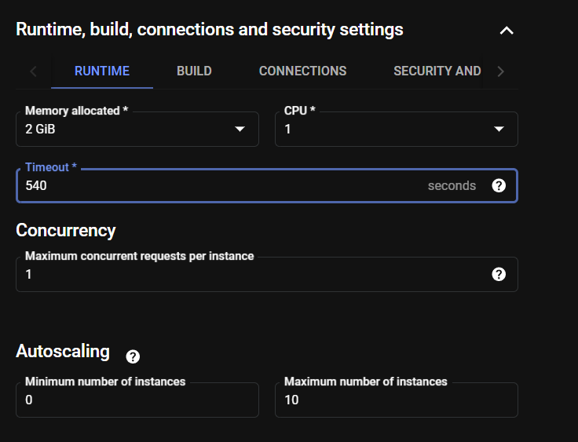

# Project-8-PDF-2-Excel

# Introduction - 
This project is about generating insights from unstructured data such as PDFs. Here we utilize python library Camelot and Google Cloud's Vision API to extract tabular data from PDFs and export them in xlsx format for further analysis. The whole process from uploading PDF files to getting xlsx files is automated thanks to triggers in Google Cloud. Feel free to use the code for your own purposes or build a better project over it.

# Tech stack used -
1. Python - Google-Cloud-Aiplatform, pandas, openpyxl, camelot and img2table libraries
2. Google Cloud Platform - Cloud Storage, Cloud Functions, Google Bigquery, Looker Studio

# Architecture - 

# How to deploy it yourself? 👇
1. Create a Cloud Storage Bucket using your desired name (Enforce public access prevention).
2. Create folders named - camelot, ocr, pass, pdfs in the bucket.

3. Now create a service account of your desired name with Cloud Storage Admin permission.

4. After the service account is created, click on the service account name.
5. Click on the Keys section on the upper bar.
6. Generate a key in JSON format from here and save it locally.

8. Upload this JSON key in the pass folder of the bucket we had created.
9. Enable Compute Engine API for easier deployment of this project.
10. Now search for Cloud Functions and click on it.
11. Click on create function and enter the following configuration (Make sure the trigger is Cloud Storage).

10. Click on the next button.
11. Change the runtime to python 3.11 and change the entry point to 'final'.
12. In main.py paste the code given in the file 'test2.py' after making changes to project name and bucket name accordingly in the code.
13. In the requirements.txt file enter the libraries mentioned in the requirements.txt file in this repo.

14. Click on the deploy button and let the function get deployed.

16. You can test the project by uploading the test.pdf file given above in the repo.
17. The excel file will be available in the ocr and camelot folders.

# Extra - 
1. You can modify the code to instead generate csv files and push it Google Bigquery.

3. You can perform analytical queries and create dashboards from Bigquery.

# Troubleshooting - 
1. You can check logs in Cloud Logging offered in the cloud console.
2. Raise an error, I will look into it.

### Thank you!!! Keep hunting!!! Keep grinding!!!🍻
